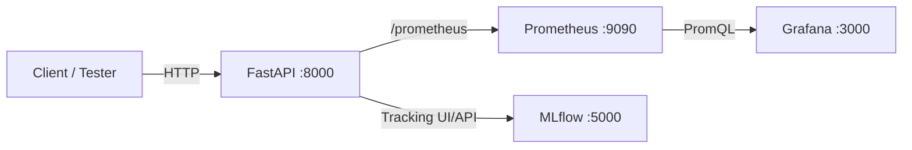

# Real‑time Fraud Detection – Production‑Ready API (FastAPI + Prometheus + Grafana + MLflow)

A minimal **MLOps-style** project that detects suspicious payment transactions in **near real-time** and supports:
- **Prediction API** with health & metrics endpoints
- **Feedback loop** to measure *real production accuracy*
- **Incremental learning hooks** + batch retraining scripts (concept + implementation starting point)
- **Monitoring** with **Prometheus** (time-series) and **Grafana** (dashboards)
- **Experiment tracking** with **MLflow** (runs in the same container in this stage)

> ✅ **Note about AWS**: In my full project, deployment was done on **AWS (VPC + Public/Private subnets, EC2, security groups, reverse proxy)**.  
> This public GitHub repo intentionally excludes infrastructure/deployment files and keeps only the **production-ready API stage**.  
> See: `docs/aws-deployment-overview.md`.

---

## What problem does this solve?

Payment gateways (e.g., PayPal-style systems) process huge volumes of transactions. Fraud often appears as **behavioral anomalies**:
- unusual amounts (e.g., jump from $15 to $2500)
- unusual times (e.g., 03:00 AM)
- unusual frequency (many transactions in short time)
- sudden shifts in user pattern (“lifestyle drift”)

This project shows how to:
1. serve predictions in real-time
2. collect monitoring/metrics + business feedback
3. keep the system improving as data changes over time (concept of continuous training)

---

## Architecture

### A) Local / Docker Compose (this repo)


### B) AWS deployment (high-level, infra files excluded)
```mermaid
flowchart TB
  subgraph AWS[VPC on AWS]
    subgraph Public[Public Subnet]
      RP[Reverse Proxy / TLS (e.g., Traefik)]
      MON[Grafana + Prometheus]
      CI[CI/CD (e.g., Jenkins)]
      Bastion[Bastion SSH]
    end
    subgraph Private[Private Subnet]
      API2[FastAPI]
      MLF2[MLflow]
      JOB[Continuous Training Job]
    end
    RP --> API2
    RP --> MLF2
    API2 --> MON
    CI -->|deploy images| RP
  end
```

---

## Repository structure

- `docker/`
  - `docker-compose.yml` – brings up FastAPI + Prometheus + Grafana
  - `prometheus.yml` – Prometheus scrape config
  - `dockerfiles/` – application source + Dockerfile
- `docs/`
  - `aws-deployment-overview.md` – AWS high-level summary (no sensitive details)
  - `SECURITY.md` – security checklist & what is intentionally excluded
  - `THREAT_MODEL.md` – threat model (STRIDE-style)
  - `RUNBOOK.md` – run checklist (local + sanity checks)
- `pics/` – screenshots used in docs

---

## Quickstart (local)

### 1) Requirements
- Docker + Docker Compose plugin

### 2) Configure secrets locally (Grafana password)
Create `.env` in repo root:
```bash
GRAFANA_ADMIN_PASSWORD=change_me_strong_password
```
> `.env` is ignored by git. Use `.env.example` as reference.

### 3) Start services
```bash
docker compose -f docker/docker-compose.yml up -d
docker compose -f docker/docker-compose.yml ps
```

### 4) Open UIs
- FastAPI: http://localhost:8000
- Prometheus: http://localhost:9090
- Grafana: http://localhost:3000  (login: admin / password from `.env`)
- MLflow: http://localhost:5000

---

## API endpoints

| Method | Path | Purpose |
|---|---|---|
| GET | `/health` | health check |
| POST | `/predict` | predict fraud probability / label |
| POST | `/feedback?actual_label=true|false` | submit business feedback |
| GET | `/metrics` | human-readable metrics summary |
| GET | `/prometheus` | Prometheus-format metrics |
| POST | `/reload-model` | hot reload model from disk |

### Example: Predict (curl)
```bash
curl -X POST "http://localhost:8000/predict" \
  -H "Content-Type: application/json" \
  -d '{
    "amount": 1500.0,
    "hour": 3,
    "day_of_week": 1,
    "merchant_category": "online",
    "previous_amount": 50.0,
    "time_since_last": 0.5
  }'
```

### Example: Feedback (curl)
```bash
curl -X POST "http://localhost:8000/feedback?actual_label=false" \
  -H "Content-Type: application/json" \
  -d '{
    "amount": 1500.0,
    "hour": 3,
    "day_of_week": 1,
    "merchant_category": "online",
    "previous_amount": 50.0,
    "time_since_last": 0.5
  }'
```

---

## Monitoring

### Prometheus
Prometheus scrapes the FastAPI metrics endpoint and stores time-series signals like:
- total predictions
- fraud predictions
- model accuracy gauge (from feedback)

### Grafana
Grafana queries Prometheus via PromQL and visualizes:
- request volume
- fraud rate
- production accuracy trend

---

## Continuous training & incremental learning

Fraud patterns drift over time. If we never update the model, performance decreases.

This repo includes:
- `src/data/generate_new_batch.py` – simulates incoming new data
- `src/models/continuous_train.py` – batch retraining pipeline
- `src/models/incremental_model.py` – starting point for incremental/online updates

See `docs/RUNBOOK.md` for the step-by-step training loop.

---

## Security (public repo rules)

This repo is sanitized for public GitHub:
- ✅ no private keys, no cloud credentials, no real IPs
- ✅ secrets are read from environment variables (`.env`)
- ✅ infra/deployment files are excluded on purpose

Read: `docs/SECURITY.md` and `docs/THREAT_MODEL.md`.

---

## Roadmap (next steps)

- Split MLflow into its own service/container
- Add auth (JWT/OAuth) for API + UIs
- Add rate limiting & abuse protection
- Add real model (feature store + offline evaluation)
- Full AWS IaC (Terraform) in a separate private repo

---

## Reference guide
The step-by-step course guide used to build this stage is included here:
- `MLOps-Project-Guide-P5.md`

Last updated: 2026-01-07
