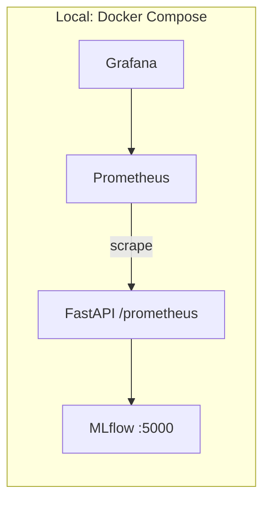

# Fraud Detection – Production-ready API (Docker + Monitoring)

This repo contains the **production-ready API** stage of a fraud-detection MLOps project:
- FastAPI inference service
- MLflow tracking server (demo: runs inside the same container)
- Prometheus metrics + Grafana

> Deployment was performed on **AWS** in the full project, but cloud/server configuration is intentionally **excluded** from this public repo. See `docs/aws-deployment-overview.md`.

## Architecture



## Run locally

1) Create environment file:
```bash
cp .env.example .env
```

2) Start services:
```bash
cd docker
docker compose up -d
```

3) Open:
- API: `http://localhost:8000/docs` (Swagger is disabled in code currently)
- Grafana: `http://localhost:3000` (password from `.env`)
- Prometheus: `http://localhost:9090`

## Model artifacts

Model pickle files are **not committed**. On first container start, `start.sh` runs training to create:
- `models/fraud_detector.pkl`
- `models/preprocessor.pkl`
